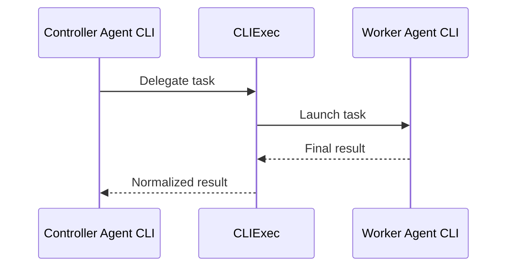

<h1 align="center">CLIExec</h1>

<p align="center"><strong>Delegate bounded work between Agent CLIs through one local interface.</strong></p>

<p align="center">
  
  
  
  <a href="LICENSE"></a>
</p>

<p align="center">
  <a href="README.md">English</a> · <a href="README.zh-CN.md">简体中文</a>
</p>

CLIExec lets the Agent CLI you are using hand a bounded task to another installed Agent CLI and receive a normalized final result. The current CLI is the controller; the delegated CLI is the worker. Each worker is described once in TOML, so controllers do not need a separate integration for every target.



> [!IMPORTANT]
> CLIExec is alpha software. After installing or upgrading a worker, run its targeted check, such as `cliexec doctor codex`, because upstream flags and output formats can change.

## What CLIExec handles

- Normalizes text, JSON, and JSONL worker output into one versioned result.
- Runs short tasks in the foreground or supervises longer tasks in the background.
- Continues supported worker sessions by exact ID while keeping every invocation as a separate run.
- Applies permission policy, timeouts, output limits, cancellation, and process-group cleanup.
- Keeps prompt transport, output parsing, permission flags, and environment access in per-worker adapters.

CLIExec runs locally and does not require a daemon or hosted control plane. Worker installation, authentication, account selection, and model selection remain under the target CLI's control.

## Supported Agent CLIs

Built-in presets are included for these workers:

| Worker | Prompt transport | Explicit local file | Explicit local image | Session continuation |
| --- | --- | :---: | :---: | :---: |
| Claude Code | stdin | No | No | Yes |
| Codex CLI | stdin | No | Yes | Yes |
| Antigravity CLI | argv | No | No | No |
| OpenCode | stdin | Yes | Yes | Yes |
| Grok Build | argv | No | No | Yes |

The file and image columns describe explicit attachment paths mapped by the built-in adapter. They do not describe workspace access. A worker can still inspect files under its working directory with its native tools, subject to the selected permission mode.

Claude Code's current `--file` option expects an existing API file ID in `file_id:relative_path` form, and its preset has no compatible local image-path flag. Grok Build's `--prompt-json` expects structured content blocks rather than a local path. Supporting these forms requires an upload or structured-input transport, which the current version does not implement.

Antigravity CLI can resume a known conversation, but its headless output does not currently expose a documented machine-readable conversation ID. CLIExec therefore does not claim session support for the `agy` preset and never falls back to a race-prone "most recent session" flag.

## Install

Requirements: Linux, Python 3.11+, [uv](https://docs.astral.sh/uv/), and at least one supported Agent CLI.

```bash
uv tool install cliexec
cliexec init
cliexec doctor codex
```

Replace `codex` with the worker you installed. `doctor` checks its executable, version, and required flags in the help output; it does not make an authenticated model call. The authenticated smoke check is documented in the packaged Skill.

`init` creates the user configuration only when it is missing. It does not overwrite existing settings. Built-in presets are enabled by default. Install and authenticate only the workers you plan to use.

Install the packaged Skill if Claude Code or Codex will use CLIExec as a controller:

```bash
cliexec skill install --target all
```

The Skill is optional for direct terminal use. It contains the controller workflow, task commands, result contract, exit codes, and failure-handling rules. See [the packaged CLIExec Skill](skills/cliexec/SKILL.md) or run `cliexec --help` when using the CLI manually.

## Continue a worker conversation

Supported presets persist a native worker session by default. Continue the latest terminal run explicitly:

```bash
cliexec run codex --cwd "$PWD" <<'EOF'
Review the current implementation.
EOF

# Read RUN_ID from data.run_id in the JSON response.
cliexec run codex --continue RUN_ID <<'EOF'
Now focus on the concurrency issue you identified.
EOF
```

Every turn receives a new `run_id`. Runs in the same linear conversation share a CLIExec `conversation_id`, and `parent_run_id` records the direct predecessor. Only the latest terminal tip can be continued; attempting to branch from an older run returns `CONVERSATION_CONFLICT`. The agent and resolved working directory cannot change. Permission, timeout, files, and images are evaluated independently for each turn, so permission defaults back to `read_only` and attachments are not repeated automatically.

Failed, timed-out, and cancelled tips remain resumable when CLIExec captured a reliable native session ID. Rejected runs and runs without an ID are not resumable. CLIExec does not expose native IDs as normalized fields; raw worker logs may still contain them. Use `--continue RUN_ID`, not a provider-specific session ID.

CLIExec does not provide a cross-worker ephemeral switch. Native session storage and retention are controlled by each worker.

## Configure CLIExec

User configuration lives at `${XDG_CONFIG_HOME:-~/.config}/cliexec/config.toml`. Repository configuration is never loaded implicitly, and unknown fields are rejected.

### Policy and preset overrides

The policy values below are the defaults. Durations accept a positive number of seconds or a string with an `s`, `m`, `h`, or `d` suffix.

```toml
# Configuration schema. The current version accepts 1.
version = 1

[policy]
# Maximum number of active tasks. Integer >= 1. Default: 4.
max_concurrency = 4

# Default task timeout. Must not exceed max_timeout. Default: "30m".
default_timeout = "30m"

# Largest timeout a controller may request. Default: "2h".
max_timeout = "2h"

# Permission ceiling: "read_only", "workspace_write", or "unrestricted".
# Individual tasks still default to "read_only".
max_permission = "workspace_write"

# Keep terminal run records for this many days. Integer >= 1. Default: 30.
retention_days = 30

# Maximum final or partial result embedded in command output, in bytes.
# Integer >= 1024. Larger results remain available in the run files.
inline_result_bytes = 262144

# Combined stdout and stderr limit per task, in bytes.
# Must be >= inline_result_bytes. Reaching it terminates the task.
max_output_bytes = 67108864

# Override one packaged preset by its config key.
[agents.grok]
# Boolean literal: true or false. Do not quote it. Packaged presets default to true.
enabled = false
```

`max_permission` is an upper bound. Each task still starts with `read_only` unless the controller requests and policy permits a higher mode.

Configure provider, account, and model choices in the worker itself. For example, OpenCode's default model belongs in OpenCode's user configuration, not in a CLIExec preset.

### Packaged presets

The source definitions are in [`src/cliexec/presets/`](src/cliexec/presets/). A release installs them inside the Python package as `cliexec/presets/*.toml`; the physical path depends on the uv tool environment. CLIExec loads these files as package resources on every run. `init` writes references for detected executables, not full copies or an allowlist; every packaged preset is still loaded.

Do not edit the installed files. An upgrade can replace them. Override a preset in the user configuration instead:

```toml
# Same-name tables are merged over the packaged preset.
[agents.claude]
enabled = false

# A new local worker name can inherit a packaged preset.
[agents.review_codex]
# Options: "agy", "claude", "codex", "grok", or "opencode".
preset = "codex"
enabled = true
```

Nested tables are merged recursively. Scalars and arrays replace the packaged value, so overriding `command`, `env.pass`, or an argument list replaces that whole array. `preset` can reference only a packaged preset and starts from its original definition, not from user overrides made to that preset name. There is no field-deletion syntax; use a new worker name for an entirely custom adapter. User configuration takes precedence over packaged presets, and an explicitly supplied configuration is added as the final layer.

## Connect another Agent CLI

"Connect" means describing how CLIExec should translate a task into one noninteractive worker process. CLIExec starts that process in the requested working directory, sends one prompt, waits for it to finish, and extracts its final answer. It does not embed the provider's SDK or automate an interactive TUI.

The target CLI needs a headless or noninteractive mode that:

- accepts one prompt through stdin or argv;
- exits on its own when the task ends;
- returns stable text, JSON, or JSONL output;
- exposes any required permission modes as command arguments.

<details>
<summary>Complete annotated adapter</summary>

```toml
# "reviewer" is the local worker name. It must be 1 to 64 lowercase
# letters, digits, hyphens, or underscores, and must start with a letter or digit.
[agents.reviewer]
# Optional: inherit a packaged preset before applying the fields below.
# Options: "agy", "claude", "codex", "grok", or "opencode".
# Omit this when defining an adapter from scratch.
# preset = "codex"

# Enable or disable this worker. Boolean literal, not a string. Default: true.
enabled = true

# Executable and fixed arguments. Required after preset merging.
command = ["reviewer-cli", "run"]

# Exit codes that mean the worker succeeded. Integer array. Default: [0].
success_exit_codes = [0]

# Allow unrestricted mode at the adapter level. Boolean literal. Default: false.
# Global policy and a modes.unrestricted table must also allow it.
allow_unrestricted = false

[agents.reviewer.input]
# Prompt transport: "stdin" or "argv". Default: "stdin".
mode = "stdin"

# Used only with mode = "argv". Must contain {prompt}. Default: "{prompt}".
# prompt_arg = "--prompt={prompt}"

# Repeat these templates for every attached local file or image.
# A non-empty array must contain {path} in at least one item; default [] means unsupported.
file_args = ["--file", "{path}"]
image_args = ["--image", "{path}"]

# Optional target-specific cwd flag. CLIExec already starts the process in cwd.
# A non-empty array must contain {cwd} in at least one item. Default: [].
cwd_args = ["--cwd", "{cwd}"]

[agents.reviewer.output]
# Worker stdout format: "text", "json", or "jsonl". Default: "text".
# "json" expects one document; "jsonl" expects one JSON value per nonblank line.
format = "jsonl"

# JSON/JSONL only: keep objects matching every entry. Dotted object keys are supported;
# array indexes and escaped dots are not.
# Default: {}, which matches every object.
match = { type = "result" }

# JSON/JSONL only: dotted object path to the final text. No default;
# required for these formats.
field = "result.text"

# Multiple matches: "first", "last", or "concat". Default: "last".
# "concat" joins matches with newlines. With format = "text", CLIExec returns
# all trimmed stdout and ignores these selectors.
collect = "last"

# Optional exact session continuation. Without this table, sessions = false.
[agents.reviewer.session]
# "output" extracts an ID from JSON/JSONL using id_match and id_field.
id_strategy = "output"
resume_args = ["--resume", "{session_id}"]
id_match = { type = "session.started" }
id_field = "session.id"

# A worker that accepts a caller-selected ID can instead use:
# id_strategy = "generated"
# new_args = ["--session-id", "{session_id}"]
# resume_args = ["--resume", "{session_id}"]

# A mode table declares support for that permission; an absent table is unsupported.
# args is a string array and may be empty.
[agents.reviewer.modes.read_only]
args = ["--sandbox", "read-only"]

[agents.reviewer.modes.workspace_write]
args = ["--sandbox", "workspace-write"]

# Optional. Keep allow_unrestricted = false unless the target is externally isolated.
# [agents.reviewer.modes.unrestricted]
# args = ["--sandbox", "danger-full-access"]

[agents.reviewer.env]
# Extra environment variable names inherited by the child. String array. Default: [].
# CLIExec also passes its fixed basic environment described in the security section.
# This allowlist does not apply to doctor probes.
pass = ["REVIEWER_API_KEY"]

[agents.reviewer.probe]
# Used only by doctor. Task execution ignores this table. Each probe has a 5-second limit.
# Probes run command[0] plus the args below; fixed command[1:] arguments are not included.
# Arguments used to read the version. Default: ["--version"].
# [] skips only when version_regex is also omitted.
version_args = ["--version"]

# Optional regex with no default. A named group called "version" is recommended.
# Without it, CLIExec uses the first dotted number in the output.
version_regex = 'reviewer-cli (?P<version>\d+\.\d+\.\d+)'

# Optional comma-separated range with no default, using <, <=, >, >=, or ==.
# An out-of-range version produces a warning rather than a hard failure.
tested_versions = ">=1.0.0,<2.0.0"

# Arguments used to read help. Default: ["--help"].
# [] skips only when help_contains is also empty.
help_args = ["--help"]

# Every token is a case-sensitive substring of combined stdout and stderr.
# A missing token makes doctor fail. Default: [].
help_contains = ["--sandbox", "--file"]
```

</details>

Add the adapter to the user configuration shown above. Validation and task commands are documented in the packaged Skill.

CLIExec executes `command` directly without a shell. The current version does not load custom parser scripts. Session adapters must either preassign an exact ID or extract one from JSON/JSONL; plain-text regexes and "resume latest" fallbacks are intentionally unsupported. If a target requires an upload handshake, a persistent daemon, TUI keystrokes, or a custom wire protocol, TOML alone is not enough for that CLI. `builtin` is internal metadata and should not be set in user configuration.

## Security model

| Area | CLIExec behavior | What you should know |
| --- | --- | --- |
| Permissions | Tasks default to `read_only`. Global `max_permission` sets the ceiling. `unrestricted` also requires the selected adapter to allow it. | Modes map to the worker's native flags. CLIExec is not an independent OS sandbox. |
| Concurrent writes | Write-capable tasks with overlapping resolved working directories cannot run at the same time. | This does not isolate CLIExec from unrelated local processes. |
| Process lifecycle | Timeout, cancellation, or output overflow terminates the worker process group. | Files changed before termination are not rolled back. |
| Nested delegation | CLIExec appends `CLIExec execution constraint: Do not invoke CLIExec or delegate this task to another agent.` to every worker prompt and sets `CLIEXEC_DEPTH=1`. Nested task submission returns `NESTED_DELEGATION`. | The original prompt remains unchanged in the run request. The prompt and environment checks prevent accidental recursion; they are not security boundaries. |
| Environment | A child receives a fixed basic environment plus variables allowed by its adapter. | Pass only variables the worker needs. |
| Stored data | Run directories use mode `0700` and files use `0600`. Plaintext records are kept under `${XDG_STATE_HOME:-~/.local/state}/cliexec` for 30 days by default. | Records are not encrypted at rest. The same OS user and root can read them. Worker-native sessions are stored and retained by each worker; `cliexec purge` removes only CLIExec records. |
| Prompt exposure | stdin keeps prompts out of the controller argv. Antigravity CLI and Grok Build presets use argv transport. | Their prompts can be visible to local process inspection. Avoid secrets. |
| Provider traffic | CLIExec's control plane is local. | A worker may send prompts, files, images, or workspace content to its configured cloud service. |
| Worker results | Results are marked as untrusted data. | The controller should verify important findings and file changes before relying on them. |

## Scope

The current version handles local tasks and exact, linear continuation of supported worker sessions. It does not provide conversation branching, naming, export, native-session deletion, multi-step workflow management, isolated worktrees, automatic merging, or remote workers. A Web UI and protocol endpoints such as MCP, ACP, or A2A are also outside the current scope.

## License

[MIT](LICENSE)
