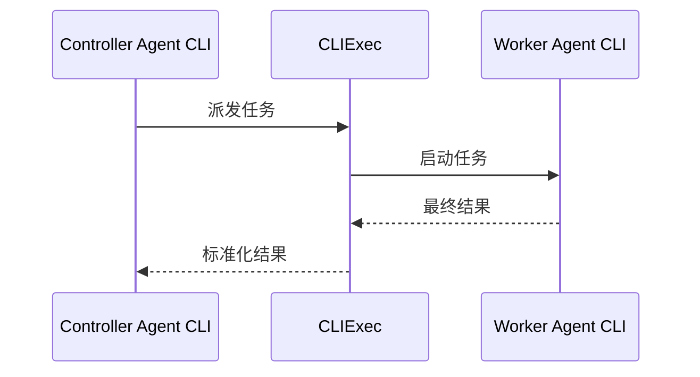

<h1 align="center">CLIExec</h1>

<p align="center"><strong>用一个本地接口，在不同 Agent CLI 之间派发范围明确的任务。</strong></p>

<p align="center">
  
  
  
  <a href="LICENSE"></a>
</p>

<p align="center">
  <a href="README.md">English</a> · <a href="README.zh-CN.md">简体中文</a>
</p>

CLIExec 让你正在使用的 Agent CLI 把范围明确的任务交给另一个已安装的 Agent CLI，并拿回统一格式的最终结果。当前 CLI 是 controller，被调用的 CLI 是 worker。每个 worker 只需用 TOML 描述一次，controller 不必为每个目标单独写一套集成。



> [!IMPORTANT]
> CLIExec 目前处于 alpha 阶段。安装或升级 worker 后，请针对它运行检查，例如 `cliexec doctor codex`，因为上游参数和输出格式可能变化。

## CLIExec 负责什么

- 把 worker 的 text、JSON 和 JSONL 输出统一为带版本号的结果格式。
- 短任务在前台执行，长任务在后台运行。
- 通过精确 ID 续接受支持的 worker session，同时保留每次调用各自的 run。
- 处理权限策略、timeout、输出上限、取消和进程组清理。
- 每个 worker 的 adapter 负责 prompt 传输、结果提取、权限参数和可继承的环境变量。

CLIExec 在本机运行，不依赖 daemon 或托管 control plane。Worker 的安装、认证、账户和 model 仍由目标 CLI 自己管理。

## 支持的 Agent CLI

项目内置以下 worker preset：

| Worker | Prompt 传输 | 显式本地文件 | 显式本地图片 | Session 续接 |
| --- | --- | :---: | :---: | :---: |
| Claude Code | stdin | 否 | 否 | 是 |
| Codex CLI | stdin | 否 | 是 | 是 |
| Antigravity CLI | argv | 否 | 否 | 否 |
| OpenCode | stdin | 是 | 是 | 是 |
| Grok Build | argv | 否 | 否 | 是 |

文件和图片两列只表示内置 adapter 能不能把 CLIExec 收到的本地路径映射为目标 CLI 的专用参数。它们不代表 worker 能不能读取仓库。只要所选权限允许，worker 仍然可以通过自己的工具查看 working directory 中的文件。

Claude Code 当前的 `--file` 接受已经存在的 API file ID，格式为 `file_id:relative_path`；它的 preset 也没有可直接映射的本地图片参数。Grok Build 的 `--prompt-json` 接受结构化 content block，而不是本地路径。要兼容这些形式，需要增加上传或结构化输入 transport，当前版本暂未实现。

Antigravity CLI 可以恢复已知 conversation，但其 headless 输出目前没有已文档化的 machine-readable conversation ID。因此 `agy` preset 不声明 session 支持，CLIExec 也不会退回到存在竞态的“最近一次 session”参数。

## 安装

运行要求：Linux、Python 3.11+、[uv](https://docs.astral.sh/uv/)，以及至少一个受支持的 Agent CLI。

```bash
uv tool install cliexec
cliexec init
cliexec doctor codex
```

请把 `codex` 换成你安装的 worker。`doctor` 只检查可执行文件、版本和 help 输出中的必需参数，不会发起需要认证的 model call。需要认证的 smoke test 写在随包发布的 Skill 中。

`init` 只会在用户配置不存在时创建文件，不会覆盖已有设置。内置 preset 默认启用，只需安装并认证准备使用的 worker。

如果要让 Claude Code 或 Codex 把 CLIExec 当作 controller，再安装随包发布的 Skill：

```bash
cliexec skill install --target all
```

直接在终端使用 CLIExec 时不必安装 Skill。Controller 的工作方式、任务命令、结果契约、exit code 和失败处理规则都在 [CLIExec Skill](skills/cliexec/SKILL.md) 中；手动操作也可以查看 `cliexec --help`。

## 继续 worker 对话

支持 session 的 preset 默认持久化 worker 原生会话。通过最新的 terminal run 精确续接：

```bash
cliexec run codex --cwd "$PWD" <<'EOF'
审查当前实现。
EOF

# 从上一个 JSON 响应的 data.run_id 取得 RUN_ID。
cliexec run codex --continue RUN_ID <<'EOF'
现在重点分析你刚才指出的并发问题。
EOF
```

每一轮都会获得新的 `run_id`。同一条线性对话中的 run 共享 CLIExec `conversation_id`，`parent_run_id` 记录直接前序。只有最新的 terminal tip 可以续接；从旧 run 分支会返回 `CONVERSATION_CONFLICT`。Agent 和 resolved working directory 不能改变。Permission、timeout、file 和 image 每轮独立计算，因此 permission 会重新默认为 `read_only`，附件也不会自动重复传入。

只要 CLIExec 已获得可靠的原生 session ID，failed、timed-out 和 cancelled tip 仍可续接；rejected 或没有 ID 的 run 不可续接。CLIExec 不会把原生 ID 暴露为标准化字段，但 raw worker log 仍可能包含它。调用者应使用 `--continue RUN_ID`。

CLIExec 不提供跨 worker 的统一 ephemeral 开关；原生 session 的存储和保留由各 worker 控制。

## 配置 CLIExec

用户配置位于 `${XDG_CONFIG_HOME:-~/.config}/cliexec/config.toml`。CLIExec 不会隐式读取仓库内的配置，无法识别的字段会直接报错。

### 策略与 preset 覆盖

下面是 policy 的默认值。Duration 可以写成正数秒，也可以使用带 `s`、`m`、`h` 或 `d` 后缀的字符串。

```toml
# 配置 schema。当前版本只接受 1。
version = 1

[policy]
# 同时运行的任务上限。整数且 >= 1，默认值为 4。
max_concurrency = 4

# 单个任务的默认 timeout，不得超过 max_timeout。默认值为 "30m"。
default_timeout = "30m"

# Controller 可以请求的最大 timeout。默认值为 "2h"。
max_timeout = "2h"

# 权限上限："read_only"、"workspace_write" 或 "unrestricted"。
# 单个任务仍默认使用 "read_only"。
max_permission = "workspace_write"

# Terminal run 记录的保留天数。整数且 >= 1，默认值为 30。
retention_days = 30

# 命令输出中内嵌 final/partial result 的字节上限。
# 整数且 >= 1024；超出的内容仍保存在 run 文件中。
inline_result_bytes = 262144

# 单个任务 stdout 与 stderr 的合计字节上限。
# 必须 >= inline_result_bytes；达到上限时会终止任务。
max_output_bytes = 67108864

# 使用配置名覆盖一个 packaged preset。
[agents.grok]
# Boolean literal：true 或 false，不要加引号。Packaged preset 默认值为 true。
enabled = false
```

`max_permission` 是权限上限。每个任务仍从 `read_only` 开始，只有 controller 主动请求且策略允许时才能提高权限。

Provider、账户和 model 应在 worker 自己的配置中设置。例如，OpenCode 的默认 model 应写入 OpenCode 的用户配置，而不是 CLIExec preset。

### Packaged preset

Preset 源文件位于 [`src/cliexec/presets/`](src/cliexec/presets/)。发布包会把它们安装为 Python package 内的 `cliexec/presets/*.toml`，具体物理路径取决于 uv tool 环境。CLIExec 每次运行都会把这些文件作为 package resource 读取。`init` 只为检测到的 executable 写入引用，不会复制完整 preset，也不会形成 allowlist；所有 packaged preset 仍会加载。

不要直接修改安装目录中的文件，升级时这些改动可能被覆盖。请在用户配置中覆盖 preset：

```toml
# 同名 table 会合并到 packaged preset 之上。
[agents.claude]
enabled = false

# 也可以用新的本地 worker 名称继承 packaged preset。
[agents.review_codex]
# 可选值："agy"、"claude"、"codex"、"grok"、"opencode"。
preset = "codex"
enabled = true
```

嵌套 table 会递归合并。Scalar 和 array 会替换 packaged preset 中的原值，因此覆盖 `command`、`env.pass` 或参数列表时，需要写出完整 array。`preset` 只能引用 packaged preset，而且会从原始定义开始，不会继承同名 preset 的用户覆盖。配置没有删除字段的语法；完全自定义 adapter 时应使用新的 worker 名称。用户配置的优先级高于 packaged preset，显式传入的配置作为最后一层叠加。

## 接入另一个 Agent CLI

这里的“接入”是指用 TOML 描述 CLIExec 应该如何把任务转换成一次非交互式 CLI 调用。CLIExec 在指定的 working directory 中启动这个进程，传入一条 prompt，等待进程退出，然后提取最终回答。它不会嵌入 provider SDK，也不会通过键盘自动化操控交互式 TUI。

目标 CLI 需要提供 headless 或 noninteractive 模式，并满足以下条件：

- 能从 stdin 或 argv 接收一条 prompt；
- 任务结束后会自行退出；
- 返回格式稳定的 text、JSON 或 JSONL；
- 所需权限模式可以用命令参数表达。

<details>
<summary>带完整注释的 adapter</summary>

```toml
# "reviewer" 是本地 worker 名称，长度为 1 至 64，只能使用小写字母、
# 数字、连字符或下划线，并且必须以字母或数字开头。
[agents.reviewer]
# 可选：先继承一个 packaged preset，再应用下面的字段。
# 可选值："agy"、"claude"、"codex"、"grok"、"opencode"。
# 从头定义 adapter 时省略这一项。
# preset = "codex"

# 是否启用。使用 Boolean literal，不要写成字符串。默认值为 true。
enabled = true

# 可执行文件与固定参数。Preset 合并完成后，此项不能为空。
command = ["reviewer-cli", "run"]

# 表示 worker 成功的 exit code。整数 array，默认值为 [0]。
success_exit_codes = [0]

# 是否在 adapter 层允许 unrestricted。使用 Boolean literal，默认值为 false。
# 全局 policy 和 modes.unrestricted table 也必须同时允许。
allow_unrestricted = false

[agents.reviewer.input]
# Prompt transport："stdin" 或 "argv"，默认值为 "stdin"。
mode = "stdin"

# 仅在 mode = "argv" 时使用，必须包含 {prompt}。默认值为 "{prompt}"。
# prompt_arg = "--prompt={prompt}"

# 每个本地文件或图片都会展开一次对应模板。
# 非空 array 至少有一项包含 {path}；默认值 [] 表示不支持该类附件。
file_args = ["--file", "{path}"]
image_args = ["--image", "{path}"]

# 目标 CLI 需要显式 cwd 参数时使用。CLIExec 已经会在 cwd 中启动进程。
# 非空 array 至少有一项包含 {cwd}，默认值为 []。
cwd_args = ["--cwd", "{cwd}"]

[agents.reviewer.output]
# Worker stdout 格式："text"、"json" 或 "jsonl"，默认值为 "text"。
# "json" 接受一个完整 document；"jsonl" 的每个非空行必须是一个 JSON value。
format = "jsonl"

# 仅用于 JSON/JSONL：保留满足全部条件的对象。Dotted object key 可用，
# 不支持 array index，也不能转义 key 中的点。
# 默认值为 {}，会匹配所有对象。
match = { type = "result" }

# 仅用于 JSON/JSONL：最终文本的 dotted object path。
# 没有默认值，这两种格式必须设置。
field = "result.text"

# 多个匹配结果的处理方式："first"、"last" 或 "concat"，默认值为 "last"。
# "concat" 用换行拼接结果。format = "text" 时返回裁剪后的完整 stdout，
# 并忽略这些 selector。
collect = "last"

# 可选的精确 session 续接。没有这个 table 时 sessions = false。
[agents.reviewer.session]
# "output" 通过 id_match 和 id_field 从 JSON/JSONL 提取 ID。
id_strategy = "output"
resume_args = ["--resume", "{session_id}"]
id_match = { type = "session.started" }
id_field = "session.id"

# 如果 worker 接受调用者指定的 ID，也可以改用：
# id_strategy = "generated"
# new_args = ["--session-id", "{session_id}"]
# resume_args = ["--resume", "{session_id}"]

# Mode table 的存在表示 adapter 支持该权限；没有对应 table 就表示不支持。
# args 是字符串 array，可以为空。
[agents.reviewer.modes.read_only]
args = ["--sandbox", "read-only"]

[agents.reviewer.modes.workspace_write]
args = ["--sandbox", "workspace-write"]

# 可选。除非目标 CLI 已被外部隔离，否则应保持 allow_unrestricted = false。
# [agents.reviewer.modes.unrestricted]
# args = ["--sandbox", "danger-full-access"]

[agents.reviewer.env]
# 额外允许子进程继承的环境变量名。字符串 array，默认值为 []。
# CLIExec 还会传递安全模型中说明的固定基础环境。
# 这个 allowlist 不作用于 doctor probe。
pass = ["REVIEWER_API_KEY"]

[agents.reviewer.probe]
# 仅供 doctor 使用，执行任务时忽略。每个 probe 的 timeout 固定为 5 秒。
# Probe 只执行 command[0] 和下面的参数，不包含 command[1:] 中的固定参数。
# 读取版本时使用的参数，默认值为 ["--version"]。
# 只有同时省略 version_regex，[] 才表示跳过。
version_args = ["--version"]

# 可选 regex，没有默认值；建议提供名为 "version" 的 named group。
# 未设置时，CLIExec 会读取输出中的第一个 dotted number。
version_regex = 'reviewer-cli (?P<version>\d+\.\d+\.\d+)'

# 可选版本范围，没有默认值；用逗号分隔，只支持 <、<=、>、>=、==。
# 超出范围只产生 warning，不会直接判定失败。
tested_versions = ">=1.0.0,<2.0.0"

# 读取 help 时使用的参数，默认值为 ["--help"]。
# 只有 help_contains 同时为空，[] 才表示跳过。
help_args = ["--help"]

# 每个 token 都按大小写敏感的 substring，在 stdout 与 stderr 合并结果中查找。
# 缺少任意 token 都会让 doctor 报告失败。默认值为 []。
help_contains = ["--sandbox", "--file"]
```

</details>

把 adapter 加到上面的用户配置文件中。验证配置和执行任务的命令放在随包发布的 Skill 中。

CLIExec 直接执行 `command`，中间不经过 shell。当前版本不加载自定义 parser script。Session adapter 必须能够预先指定精确 ID，或从 JSON/JSONL 中提取 ID；plain-text regex 和“恢复最近 session”的 fallback 均不支持。如果目标 CLI 必须先上传文件、依赖持久 daemon、只能用 TUI 操作，或者使用自定义 wire protocol，仅靠 TOML 还无法接入。`builtin` 是内部 metadata，不应写入用户配置。

## 安全模型

| 范围 | CLIExec 的行为 | 用户需要知道什么 |
| --- | --- | --- |
| 权限 | 任务默认使用 `read_only`。全局 `max_permission` 决定上限；`unrestricted` 还需要目标 adapter 明确允许。 | 权限会映射成 worker 的原生参数。CLIExec 本身不是独立的 OS sandbox。 |
| 并发写入 | 解析后的 working directory 有重叠时，多个可写任务不能同时运行。 | 这不会隔离 CLIExec 之外的其他本地进程。 |
| 进程生命周期 | Timeout、取消或输出超限时，CLIExec 会终止 worker 进程组。 | 终止前已经写入的文件不会自动回滚。 |
| 嵌套派发 | CLIExec 会在每个 worker prompt 末尾追加 `CLIExec execution constraint: Do not invoke CLIExec or delegate this task to another agent.`，并设置 `CLIEXEC_DEPTH=1`。嵌套提交任务会返回 `NESTED_DELEGATION`。 | run request 中仍保留原始 prompt。Prompt 和环境变量检查用于防止意外递归，不是安全边界。 |
| 环境变量 | 子进程会继承固定的基础环境，以及 adapter 额外允许的变量。 | 只传 worker 确实需要的变量。 |
| 本地记录 | run 目录权限为 `0700`，文件权限为 `0600`。明文记录默认在 `${XDG_STATE_HOME:-~/.local/state}/cliexec` 保留 30 天。 | 记录未加密存储，同一 OS 用户和 root 仍可读取。Worker 原生 session 由各 worker 自行存储和保留；`cliexec purge` 只删除 CLIExec 记录。 |
| Prompt 暴露 | stdin 可以避免 prompt 出现在 controller argv 中。Antigravity CLI 和 Grok Build preset 使用 argv。 | 这两个 worker 的 prompt 可能被本机进程检查工具看到，不要传敏感信息。 |
| Provider 流量 | CLIExec 的 control plane 在本机。 | Worker 仍可能把 prompt、文件、图片或 workspace 内容发送给已配置的云服务。 |
| Worker 结果 | 返回结果会标记为不可信数据。 | Controller 应核实重要结论和文件改动后再采用。 |

## 项目边界

当前版本处理本机任务，并支持对 worker session 进行精确、线性的续接。它不提供 conversation 分支、命名、导出、原生 session 删除、多步骤 workflow 管理、隔离 worktree、自动合并或远程 worker。Web UI 和 MCP、ACP、A2A 等协议接口也不在当前范围内。

## 许可证

[MIT](LICENSE)
